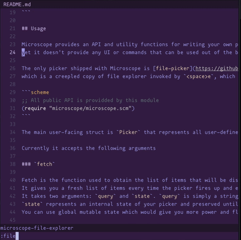

# microscope.hx

Customizable pickers for Helix, inspired by [Telescope](https://github.com/nvim-telescope/telescope.nvim).



## Installation

**NOTE: Helix plugin support is still experimental**

Follow the instructions [here](https://github.com/mattwparas/helix/blob/steel-event-system/STEEL.md) to install Helix with its plugin branch.

Once you have Helix with the plugin support you also should have `steel` REPL and `forge` package manager.

You can install the notify.hx with Forge now:

```sh
forge pkg install --git https://github.com/chuwy/microscope.hx.git
```

## Usage

Microscope provides an API and utility functions for writing your own pickers,
yet it doesn't provide any UI or commands that can be used out of the box.

The only picker shipped with Microscope is [file-picker](https://github.com/chuwy/microscope.hx/blob/trunk/microscope-file-explorer.scm),
which is a creepled copy of file explorer invoked by `<space>e`, which nevertheless gives you a good glimplse what the API can do.

```scheme
;; All public API is providded by this module
(require "microscope/microscope.scm")
```

The main user-facing struct is `Picker` that represents all user-defined behaviour of your picker.

Currently it accepts the following arguments

### `fetch`

Fetch is the function used to obtain the list of items that will be displayed in the picker.
It gives you a fresh list of items every time the picker fires up and every time user types in something in the input field.
It takes two arguments: `query` and `state`. `query` is simply a string entered in the input field (remember `fetch` fires up every time `query` is modified, no caching yet).
`state` represents an internal state of your picker and preserved until the picker is closed.
You can use global mutable state which would give you more power and flexiblity, but `state` argument is neat functional way to mutate local state. Very often it's just `#f` or `void`.

The return type must be a list containing arbitrary types. The only requirement for these types is to be renderable by next `show` function.

```scheme
(define (fetch query state) (get-a-list-from-service query))
```

### `show`

Show is applied applied to every element of the list obtained with `fetch`.
It takes two arguments: `item` and `width`. First being the list element and second being the width of the list area if you want to trim the output.

The return type must be `Line`. `Line` is a struct wrapping two lists of pairs.
Former list represents sections aligned by the left-hand side.
Latter list represents sections aligned by the right-hand side.
Every section is a pair of the actual text and the style or just text if you're okay with text being colored as `ui.text`.

```scheme
(define (show item width)
        (Line (list (cons (name-of item) "ui.directory") (cons (size-of item) "ui.text"))  ;; left-hand side
              (list (cons (status-of item) "warning"))))                                   ;; right-hand side
```

### `on-select`

This callback is invoked when user hits Enter on a certain item.
It takes the two arguments: `selected` and `state`. `selected` is again the arbitrary type obtained by `fetch`.
`state` is the internal state from `fetch`.

`on-select` supposed to cause some side-effects (opening files, pasting data into buffer etc),
but also supposed to return a pair of event-result (from `helix/components` builtin) and new state.

```scheme
(define (on-select item state)
        (open (get-file-path item))    ;; side-effect
        (cons event-result/close #f))  ;; return pair
```

If event result is close - the picker will be closed,
if it's consume - a `fetch` will be invoked again to obtain another list of items. `query` will be empty, but state change is up to you. 

### `preview`

This argument can be `#f` if you don't need a preview window, that's ok.
But if you do need it - it must a function taking an item you've got with `fetch` and returning a list of strings that are to become lines in the preview window.
Microscope will be truncate each line to specified width and drop the lines that don't fit the height. 

You often want to take some ready previewers, e.g. there's `file-previewer` defined in `previewer.scm` that is given a file path will output its contents.

That's it. You can construct your `Picker`, pass it to `microscope` function and *provide* from your `init.scm`:

```scheme
;; init.scm
(require "microscope/microscope.scm")
(require "microscope/previewer.scm")

(provide my-cool-picker) 

(define (my-cool-picker)
        (microscope (Picker fetch show on-select file-previewer)))
```

